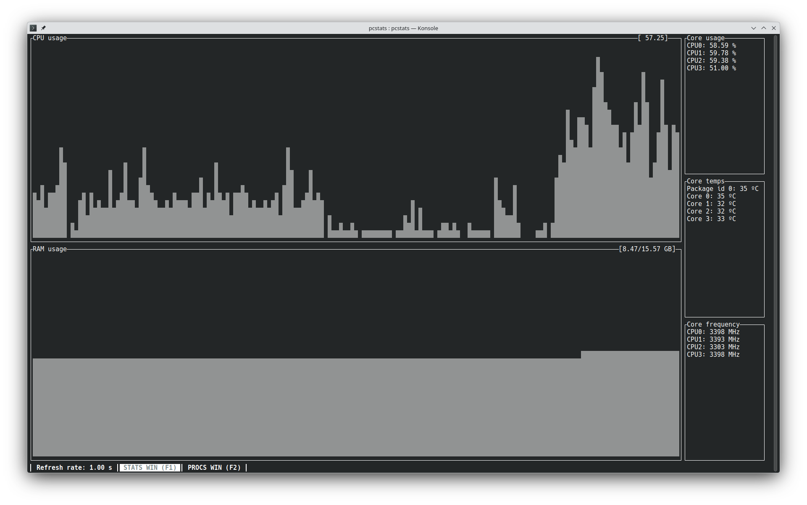
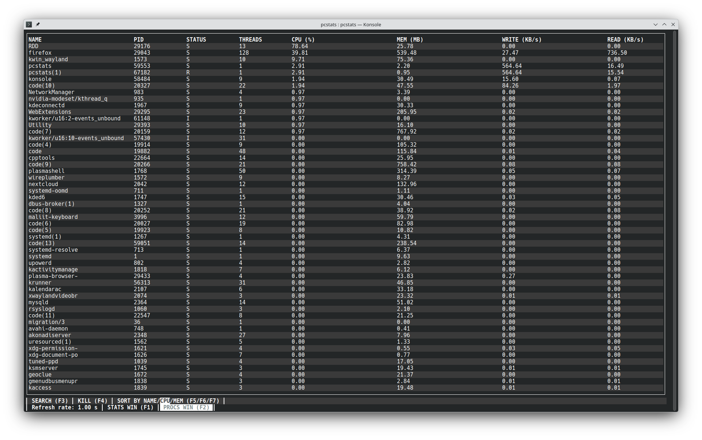

# Linux CPU and RAM monitor
Just created this to play a little bit with /proc/ folder on Linux and test DEB packages
## Installation
### Debian based distributions 
Download the [deb package](https://github.com/001roc20/pcstats/releases)

Open a terminal in the download folder and run the following command:
```bash
sudo dpkg -i pcstats.deb
```
If you get a dependency error, run:
```bash
sudo apt install -f
```
### Build from source

#### Requirements
-  ```g++```
- ```make``` 
- ```libncurses-dev```

```bash
git clone https://github.com/rocsalvador/pcstats.git
cd pcstats
make -j
```

## Usage
```bash
pcstats [OPTIONS]
OPTIONS:
-n refres_rate     set refresh rate (default: 1s)
```
## Example

